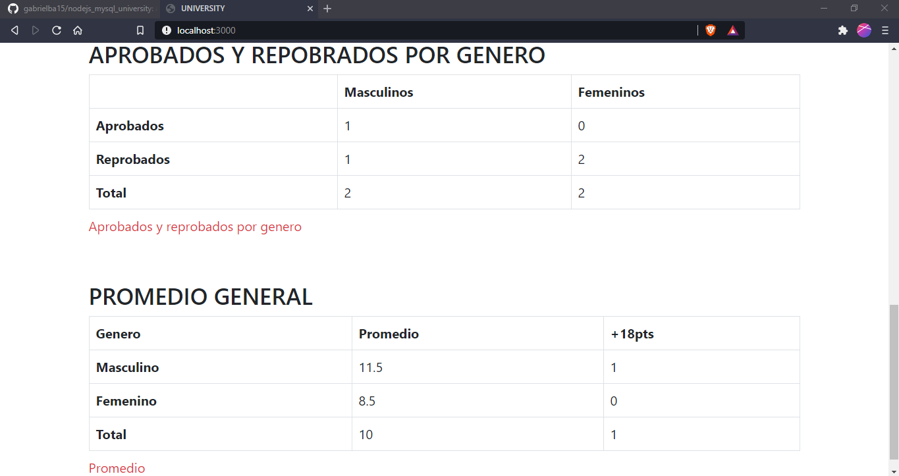

# NODEJS Y MYSQL APP
Aplicacion dedicada a llevar el control de alumnos reprobados y aprobados en una universidad, correspondiente a una asignacion de la materia Laboratiorio de Datos.

# Asignación/Problema 
Realice un formulario para un colegio para llevar el control de los alumnos aprobados y reprobados.

Alimentar con:
- Cédula del alumno.
- Género del alumno.
- Nota Promedio del Alumno.

Y debe mostrar el siguiente reporte:

- Cantidad de aprobados.
- Cantidad de reprobados.
- Cantidad de masculinos totales.
- Cantidad de femeninas totales.
- Cantidad de masculinos reprobados.
- Cantidad de masculinos reprobados.
- Cantidad de femeninas aprobadas.
- Cantidad de femeninas reprobadas.
- Promedio por género y promedio total.
- Cantidad de alumnos con notas mayores o iguales a 18.

# Página principal

# Requerimientos
- [nodejs](https://nodejs.org)
- [npm](https://nodejs.org)
- [git](https://git-scm.com)

# Para tener activa la app
1. Clonar repositorio con git, GitHub CLI o descargar la carpeta comprimida.
~~~ 
# cmd 
 cd %USERPROFILE%\Desktop 
 git clone https://github.com/gabrielba15/nodejs_mysql_university.git 
~~~
2. Dentro de la carpeta clonada haz los siguientes comandos:
~~~
npm install
npm start
~~~
- npm install para descargar las dependencias
- npm start para arrancar el servidor
3. Ve a localhost:3000 en tu navegador 
4. Listo, happy hacking crack :D
