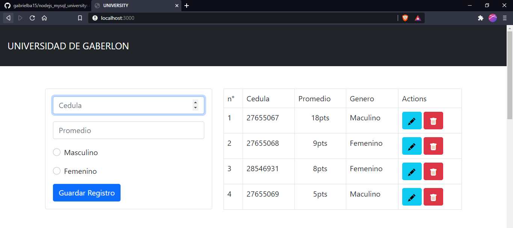
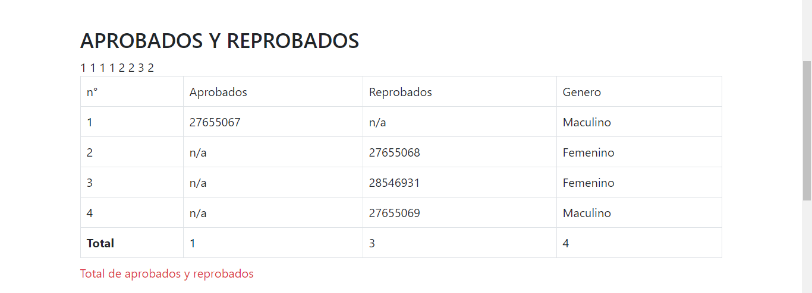

# NODEJS Y MYSQL APP
Aplicacion dedicada a llevar el control de alumnos reprobados y aprobados en una universidad, correspondiente a una asignacion de la materia Laboratiorio de Datos.

# Asignación/Problema 

# Página principal

# Página secundaria

# Página para editar

# Requerimientos
- [nodejs](https://nodejs.org)
- [npm](https://nodejs.org)
- [git](https://git-scm.com)

# Para tener activa la app
1. Clonar repositorio con git, GitHub CLI o descargar la carpeta comprimida.
~~~ 
# cmd 
~~~
~~~
 cd %USERPROFILE%\Desktop 
~~~ 
~~~
git clone https://github.com/gabrielba15/php_mysql_store.git 
~~~ 
~~~
2. npm install
3. npm start
~~~
4. Ve a localhost:3000
5. Listo, happy hacking crack :D
